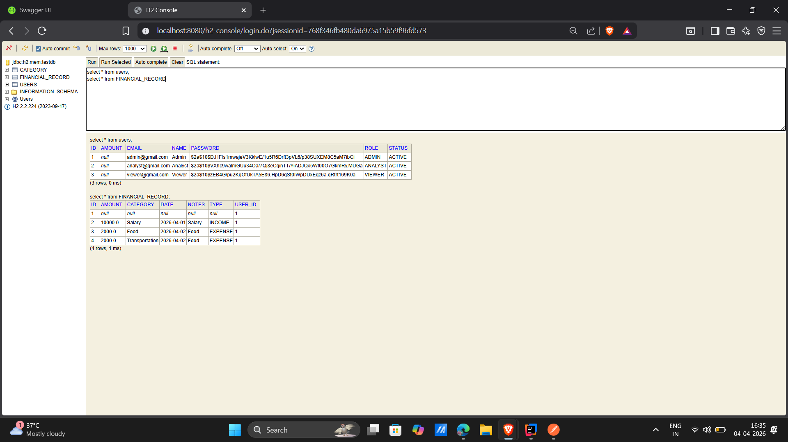
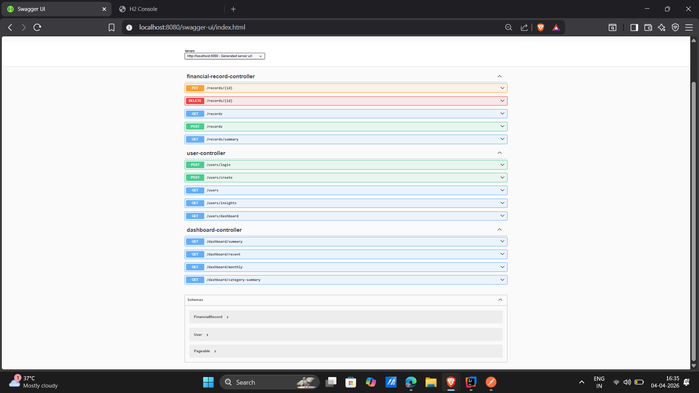

# Finance Backend System

## 📌 Overview
A robust Spring Boot backend designed for managing users and financial records. This system implements **Role-Based Access Control (RBAC)**, **JWT Authentication**, and provides **Aggregated Analytics** for a finance dashboard.

### 🧠 Design Decisions & Assumptions
* **Stateless Auth:** Used **JWT (JSON Web Token)** instead of sessions to ensure the backend remains scalable and follows modern REST best practices.
* **H2 Database:** Implemented an in-memory H2 database to allow for "zero-setup" testing by evaluators.
* **Global Exception Handling:** Utilized `@ControllerAdvice` to provide clean, consistent error responses and appropriate HTTP status codes (e.g., 400 for validation errors, 403 for access denied).
* **Bootstrap Logic:** The first user is allowed to be created without authentication to enable initial system setup.

---

## ⚙️ Quick Start & Test Flow

### 1. Run Project
Ensure you have Maven installed, then run:
```bash
mvn spring-boot:run
```
* **Swagger UI:** [http://localhost:8080/swagger-ui/index.html](http://localhost:8080/swagger-ui/index.html)
* **H2 Console:** [http://localhost:8080/h2-console](http://localhost:8080/h2-console) (JDBC URL: `jdbc:h2:mem:testdb`)

---

### 2. Create First Admin User (Bootstrap)
*No Authentication Required for this initial step.*

**POST** `/users/create`
```json
{
  "name": "Admin User",
  "email": "admin@test.com",
  "password": "password123",
  "role": "ADMIN",
  "status": "ACTIVE"
}
```

---

### 3. Login to Get JWT Token
**POST** `/users/login`
```json
{
  "email": "admin@test.com",
  "password": "password123"
}
```
*Copy the `token` value from the JSON response.*

---

### 4. Use Token for Secured APIs
In Postman, add the following header to all subsequent requests:
* **Key:** `Authorization`
* **Value:** `Bearer <PASTE_YOUR_TOKEN_HERE>`

---
### 4. Sample Data / Bootstrap Records
To test the system quickly, the following sample users and financial records can be created:

#### Users
| Name        | Email              | Role    | Status |
| ----------- | ----------------- | ------- | ------ |
| Admin User  | admin@test.com     | ADMIN   | ACTIVE |
| Analyst One | analyst@test.com   | ANALYST | ACTIVE |
| Viewer One  | viewer@test.com    | VIEWER  | ACTIVE |

#### Sample Financial Record
| Amount | Type   | Category       | Date       | Notes                   |
| ------ | ------ | -------------- | ---------- | ----------------------- |
| 5000   | INCOME | Salary         | 2026-04-01 | April Salary Deposit    |
| 1500   | EXPENSE| Groceries      | 2026-04-02 | Weekly groceries        |
| 200    | EXPENSE| Utilities      | 2026-04-03 | Electricity Bill        |


#### H2 Console Screenshot

*H2 database showing sample users and financial records.*
## 🚀 Key APIs

### **User Management**
* `GET /users` — List all users (Admin only).
* `POST /users/create` — Create new user (Public for first user/Admin for others).

### **Financial Records (CRUD + Filtering)**
* `GET /records` — View all records. Supports filtering by `date`, `category`, and `type`.
* `POST /records` — Create a record (Admin/Analyst).
* `PUT /records/{id}` — Update a record (Admin only).
* `DELETE /records/{id}` — Remove a record (Admin only).

### **Dashboard Summary (Business Logic)**
* `GET /dashboard/summary` — Returns **Total Income**, **Total Expenses**, and **Net Balance**.
* `GET /dashboard/category-totals` — Returns total spending grouped by Category.
* `GET /dashboard/trends` — Returns weekly/monthly financial trends.

---


#### Swagger UI Screenshot

*Swagger UI listing all available APIs for testing.*
## 🛠 Tech Stack
* **Java 17+** & **Spring Boot 3.x**
* **Security:** Spring Security & JWT
* **Persistence:** Spring Data JPA with **H2 In-Memory Database**
* **Validation:** Jakarta Bean Validation (Hibernate Validator)
* **Documentation:** SpringDoc / Swagger UI

---

## 🔐 Role-Based Access Control (RBAC)

| Role | Access Level |
| :--- | :--- |
| **Admin** | Full system management (Users, Records, and Analytics). |
| **Analyst** | Can read/create records and access all Analytics/Insights. |
| **Viewer** | Read-only access to Dashboard summaries. |

---

## 🏗 Project Architecture
The project follows a **Layered Architecture** to ensure separation of concerns:
1.  **Controller Layer:** Handles HTTP requests and input validation.
2.  **Service Layer:** Contains business logic, calculations for summaries, and authorization checks.
3.  **Repository Layer:** Manages data persistence via JPA.
4.  **Security Layer:** Custom JWT Filters and Security Configurations.

---

## 💡 Final Notes
* **Validation:** All inputs are validated at the API level (e.g., proper email format, positive amounts).
* **Maintainability:** Code is modularized into packages (dto, entity, service, repository) for easy navigation.
* **Scalability:** While H2 is used for this demo, the `application.properties` can be easily updated to point to MySQL or PostgreSQL.